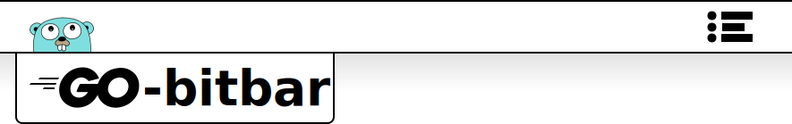

[![Travis Badge]][Travis]
[![Go Report Card Badge]][Go Report Card]
[![GoDoc Badge]][GoDoc]

This repo contains a package for creating [BitBar](https://github.com/matryer/bitbar) plugins in Go.

## Installation

Install the bitbar library with `go get`, like so:

    go get -u github.com/johnmccabe/go-bitbar

## Examples

- Refer to the [godocs](https://godoc.org/github.com/johnmccabe/go-bitbar) for an example.
- [vmpooler-bitbar](https://github.com/johnmccabe/vmpooler-bitbar) is used to monitor and manage VMs running on [Puppetlabs vmpooler](https://github.com/puppetlabs/vmpooler)
- [openfaas-bitbar](https://github.com/johnmccabe/openfaas-bitbar) is used to monitor and manage functions running on [OpenFaaS](https://github.com/openfaas/faas)
- *If you are using [go-bitbar](https://github.com/johnmccabe/go-bitbar) please reach out to be added to this list*

[Travis]: https://travis-ci.org/johnmccabe/go-bitbar
[Travis Badge]: https://travis-ci.org/johnmccabe/go-bitbar.svg?branch=master
[Go Report Card]: https://goreportcard.com/report/github.com/johnmccabe/go-bitbar
[Go Report Card Badge]: https://goreportcard.com/badge/github.com/johnmccabe/go-bitbar
[GoDoc]: https://godoc.org/github.com/johnmccabe/go-bitbar
[GoDoc Badge]: https://godoc.org/github.com/johnmccabe/go-bitbar?status.svg
